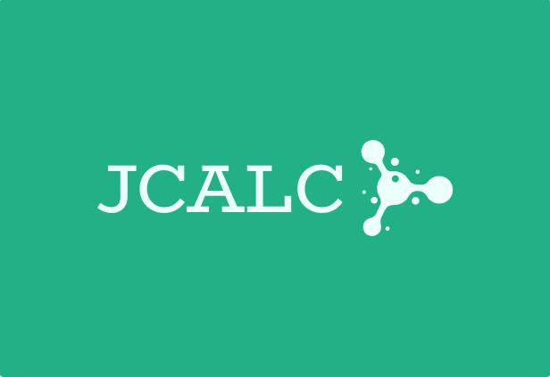

<h1 align="center">Proyecto de Lenguaje de Programación con ANTLR4: Implementación de Join Calculus</h1>
<p align="center">
  
</p>

Este proyecto es una implementación de un prototipo de lenguaje de programación que implementa Join Calculus. El lenguaje ha sido desarrollado utilizando ANTLR4 y Java.

## Descripción

Join Calculus es un modelo de programación concurrente basado en el cálculo de procesos. Este proyecto implementa un subconjunto de Join Calculus, proporcionando una forma de describir y ejecutar programas concurrentes.

## Características

- Soporte para definiciones de canales y procesos.
- Soporte para operaciones de envío y recepción en canales.
- Soporte para operaciones de control de flujo como condicionales y bucles.
- Soporte para operaciones aritméticas y booleanas.

## Requisitos

- Java 17 o superior (Usamos la version 21 LTS)
- Maven

## Compilación y Ejecución

Para compilar el proyecto, navegue hasta el directorio raíz del proyecto y ejecute el siguiente comando:

```bash
mvn clean package
```

Luego ejecute el siguiente comando para crear un archivo jar con todas las dependencias incluidas:

```bash
mvn clean compile assembly:single
```

Para ejecutar el proyecto, use el siguiente comando, reemplazando `nombre-del-archivo` con el nombre de su archivo de entrada:

```bash
java -jar target/joincalculus-1.0-SNAPSHOT-jar-with-dependencies.jar
```
Adicionalmente hemos agregado un archivo compilado jar del proyecto, el cual puede ser ejecutado con el siguiente comando:

```bash
java -jar EJECUTABLE/joincalculus.jar
```

## Ejemplos

Puede encontrar ejemplos de programas escritos en nuestro lenguaje en el directorio `src/test/resources/`.
Así como tambien en la carpeta `EJECUTABLE/` se encuentran los archivos de prueba.

```bash
java -jar joincalculus.jar ej5.jcalc
```

## Equipo de Desarrollo

- Cesar Fabian Rincon Robayo: crinconro@unal.edu.co
- Julian Andres Vargas Gutierrez: julvargasgu@unal.edu.co
- Diana Marcela Bello Lopez: dbellol@unal.edu.co
- Javier Esteban Gonzalez Vivas: javgonzalezvi@unal.edu.co
- Kevin Julian Gonzalez Guerra: kgonzalezg@unal.edu.co

## Licencia

Este proyecto está licenciado bajo los términos de la licencia MIT.

## Contribuciones

Las contribuciones son bienvenidas. Por favor, abra un problema o haga un pull request para sugerencias de mejoras o correcciones de errores.

## Agradecimientos

Agradecemos a la Universidad Nacional de Colombia por proporcionar el entorno y los recursos para desarrollar este proyecto.